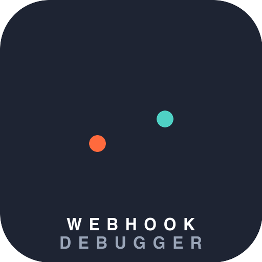

<p align="center">
  
</p>

<h1 align="center">Webhook Debugger API</h1>

<p align="center">Receive, inspect, and replay webhooks — debug integrations without a public endpoint of your own.</p>

<p align="center">
  <a href="https://github.com/jordicasadevall/webhook-debugger-api/actions/workflows/ci.yaml"></a>
  
  = 8.5">
</p>

## Why

Point any webhook provider (Stripe, GitHub, Shopify, n8n, ...) at an inbox's
receiving URL, then list, inspect, and replay the requests it captured — to
any destination URL — without exposing your local dev server or writing
throwaway logging code.

## Quick start

```console
git clone https://github.com/jordicasadevall/webhook-debugger-api.git
cd webhook-debugger-api
docker compose up --wait
```

Create an inbox and grab its receiving URL:

```console
curl -sk -X POST https://localhost:8443/inboxes | tee /dev/stderr
```

```json
{
  "id": "b3f1c2a0-...",
  "name": null,
  "url": "https://localhost:8443/in/b3f1c2a0-...",
  "created_at": "2026-09-07T12:00:00+00:00"
}
```

Point a webhook provider at that `url` (or send it a test request yourself):

```console
curl -sk -X POST https://localhost:8443/in/b3f1c2a0-... \
  -H 'Content-Type: application/json' \
  -d '{"hello": "world"}'
```

List, inspect, replay, or delete what was captured:

```console
# List events in the inbox
curl -sk https://localhost:8443/inboxes/b3f1c2a0-.../events

# Full detail of one event (headers, raw + parsed body, client IP, ...)
curl -sk https://localhost:8443/inboxes/b3f1c2a0-.../events/<eventId>

# Replay the exact same request to a different destination
curl -sk -X POST https://localhost:8443/inboxes/b3f1c2a0-.../events/<eventId>/replay \
  -H 'Content-Type: application/json' \
  -d '{"target_url": "https://example.com/webhook-handler"}'

# Delete a captured event (the inbox and its receiving URL keep working)
curl -sk -X DELETE https://localhost:8443/inboxes/b3f1c2a0-.../events/<eventId>
```

`-k`/`sk` is only needed for the locally-generated dev TLS certificate; drop
it once you have a real one (see [`docs/tls.md`](docs/tls.md)).

## API docs

Interactive Swagger UI is served by the app itself at
[`/docs`](https://localhost:8443/docs); the raw spec is at `/docs/openapi.yaml`
([`src/Controller/DocsController.php`](src/Controller/DocsController.php),
[`openapi.yaml`](openapi.yaml)).

## Configuration

All variables live in [`.env`](.env) (defaults) and can be overridden in
`.env.local` or the deploy environment:

| Variable                                  | Default                   | Meaning                                                                                                                                                                                                                                                    |
| ----------------------------------------- | ------------------------- | ---------------------------------------------------------------------------------------------------------------------------------------------------------------------------------------------------------------------------------------------------------- |
| `GATEWAY_SECRET`                          | _(empty)_                 | Shared secret required on every endpoint except the webhook receiver and docs, via `GATEWAY_SECRET_HEADER`. Empty disables the check — the default for self-hosting with no gateway in front. Falls back to `RAPIDAPI_PROXY_SECRET` if that's set instead. |
| `GATEWAY_SECRET_HEADER`                   | `X-RapidAPI-Proxy-Secret` | Header name the gateway secret is expected on.                                                                                                                                                                                                             |
| `EVENT_RETENTION_DAYS`                    | `7`                       | How long captured events are kept before `bin/console app:events:cleanup` deletes them. That command does nothing on its own — schedule it (e.g. daily cron) on whatever host runs this. Inboxes are never deleted, only their events.                     |
| `DATABASE_URL`                            | local Postgres            | Doctrine DBAL connection string.                                                                                                                                                                                                                           |
| `APP_SECRET`                              | _(empty)_                 | Symfony's app secret; set a real random value in any real deployment.                                                                                                                                                                                      |
| `SERVER_NAME`                             | `localhost`               | Domain Caddy serves and requests a TLS cert for.                                                                                                                                                                                                           |
| `HTTP_PORT` / `HTTPS_PORT` / `HTTP3_PORT` | `8080` / `8443` / `8443`  | Local port bindings.                                                                                                                                                                                                                                       |

## Security model

- **SSRF protection on replay** — [`WebhookReplayer`](src/Service/WebhookReplayer.php)
  resolves the target host once, rejects loopback/private/link-local/cloud-
  metadata ranges, and pins the outgoing connection to the already-validated
  IP so DNS can't re-resolve to something else between the check and the
  request (DNS-rebinding).
- **Rate limiting** — the webhook receiver is limited per source IP and per
  inbox (it's called directly by third-party senders with no other guard);
  replay is limited tighter, since each call makes this server issue an
  outbound request to a caller-chosen URL. See
  [`config/packages/framework.yaml`](config/packages/framework.yaml).
- **Request body cap** — the receiver rejects bodies over 1 MB before any
  further processing.
- **Optional gateway secret** — see [`GATEWAY_SECRET`](#configuration) above
  and [`GatewaySecretGuard`](src/EventListener/GatewaySecretGuard.php). This
  is what lets the same codebase be listed behind a paid API gateway (e.g.
  RapidAPI) while still being fully usable self-hosted with no gateway.

## Deployment

See [`docs/production.md`](docs/production.md) for the generic Docker Compose
production setup and [`docs/deployment-checklist.md`](docs/deployment-checklist.md)
for the project-specific steps (secrets, migrations, the cleanup cron job,
and — optionally — listing the API on a gateway like RapidAPI).

## Development

```console
# Run the test suite (controllers, services, listeners, commands)
docker compose exec php bin/phpunit

# Run pending migrations
docker compose exec php bin/console doctrine:migrations:migrate
```

Also see [`docs/xdebug.md`](docs/xdebug.md), [`docs/mysql.md`](docs/mysql.md),
and [`docs/troubleshooting.md`](docs/troubleshooting.md). Contribution
guidelines are in [`CONTRIBUTING.md`](CONTRIBUTING.md).

## Credits & license

MIT licensed — see [`LICENSE`](LICENSE). Builds on
[`symfony/skeleton`](https://github.com/symfony/skeleton) and
[Symfony Docker](https://github.com/dunglas/symfony-docker); see
[`NOTICE`](NOTICE).
